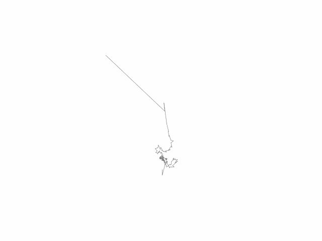

# vector_tracer

This Python script traces SVG and CSV vector files using the discrete Fourier
transform.

## Required modules

* sys
* pathlib
* re
* math
* numpy
* matplotlib
* xml.dom
* svg.path
* csv

## Usage

```bash
vector_tracer [-h] [-c] input_(svg|csv)_path [color] [output_gif_path]

  -h: this help
  -c: draw circles
```

## Example

`grasslogo.svg` is also available from
https://grass.osgeo.org/images/logos/grasslogo.svg. `horse.csv` and `lion.csv`
were created using coordinates from
https://andymac-2.github.io/fourier-polygon/.

```bash
vector_tracer grasslogo.svg green fourier-grasslogo.gif
vector_tracer -c grasslogo.svg green fourier-grasslogo-with-circle.gif
vector_tracer horse.csv brown fourier-horse.gif
vector_tracer lion.csv khaki fourier-lion.gif
```




## License

Copyright (C) 2021, Huidae Cho <<https://idea.isnew.info>>

This program is free software: you can redistribute it and/or modify
it under the terms of the GNU General Public License as published by
the Free Software Foundation, either version 3 of the License, or
(at your option) any later version.

This program is distributed in the hope that it will be useful,
but WITHOUT ANY WARRANTY; without even the implied warranty of
MERCHANTABILITY or FITNESS FOR A PARTICULAR PURPOSE.  See the
GNU General Public License for more details.

You should have received a copy of the GNU General Public License
along with this program.  If not, see <<https://www.gnu.org/licenses/>>.
